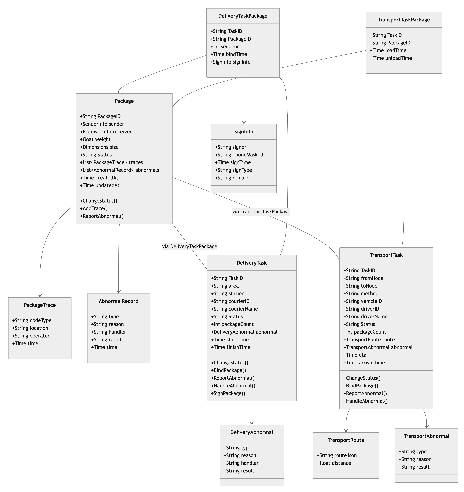
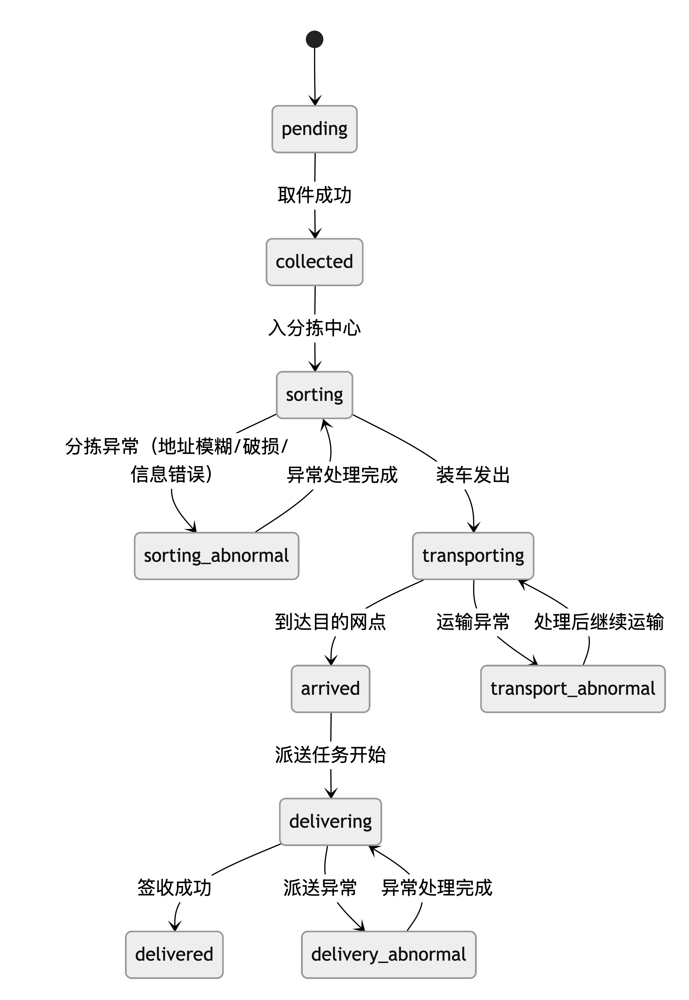

# fdu-lab3
复旦大学2025fall高级软开作业repo（小组14

# 物流管理系统领域模型全解析

## 1. 包裹领域（Package Domain）

### 核心实体
#### Package（包裹）
- **定义**：物流流转的核心载体，记录从寄件到签收的全生命周期信息
- **核心属性**：
    - 标识信息：`PackageID`（运单号，主键）
    - 收发件信息：寄件人/收件人姓名、电话、地址（含省市区三级划分）
    - 物品特征：重量、长宽高尺寸
    - 状态管理：`Status`（pending/collected/sorting/transporting/arrived/delivering/delivered/delivery_abnormal）
    - 异常追踪：异常原因、处理人
    - 时间戳：创建时间、更新时间

#### 关联值对象
- **PackageTrace（包裹轨迹）**：记录包裹在各节点的流转信息，包含节点类型（collection/sorting/transporting等）、位置坐标、操作人、时间戳等
- **AbnormalRecord（异常记录）**：记录包裹处理过程中的异常情况，包含异常类型、原因、处理方式、处理状态等

### 核心行为
- 状态流转：遵循预定义的生命周期状态变更规则（如从arrived到delivering的状态切换）
- 轨迹记录：每经过一个物流节点生成对应的轨迹信息（如运输到站、开始派送等节点）
- 异常处理：支持异常上报与处理结果记录（如分拣异常、派送异常）

## 2. 派送领域（Delivery Domain）

### 核心实体
#### DeliveryTask（派送任务）
- **定义**：指派给派送员的包裹派送工作单元，包含完整的派送生命周期管理
- **核心属性**：
    - 标识信息：`TaskID`（唯一标识，格式：DELI+时间戳+随机串）
    - 任务信息：派送区域、起点网点、派送员ID/姓名
    - 状态管理：`Status`（pending/delivering/completed/abnormal）
    - 数量统计：绑定包裹数量
    - 时间戳：开始时间、完成时间、创建/更新时间
    - 嵌套值对象：`DeliveryAbnormal`（异常信息）

#### DeliveryTaskPackage（派送任务-包裹关联）
- **定义**：维护派送任务与包裹的多对多关系，记录包裹在派送环节的状态
- **核心属性**：
    - 关联信息：派送任务ID、包裹运单号、绑定时间、派送顺序
    - 嵌套值对象：`SignInfo`（签收信息，包含签收人、脱敏电话、时间、类型、备注）

### 核心值对象
- **DeliveryAbnormal**：描述派送异常特征，包含异常类型（receiver_absent/address_error/package_damage等）、原因、处理人、处理结果
- **SignInfo**：记录包裹签收详情，包含签收人信息、时间、类型（本人/柜机/代签）及备注

### 核心行为
- `ChangeStatus()`：按规则变更任务状态（如pending→delivering→completed），状态变更时同步更新关联包裹状态
- `BindPackage()`：将包裹绑定到任务（仅pending状态允许，且包裹需处于arrived状态）
- `ReportAbnormal()`：上报派送异常并同步包裹状态为delivery_abnormal
- `HandleAbnormal()`：处理异常并恢复任务流转
- `SignPackage()`：记录包裹签收信息并对手机号进行脱敏处理（保留后4位）

## 3. 运输领域（Transport Domain）

### 核心实体
#### TransportTask（运输任务）
- **定义**：负责包裹在不同网点/分拣中心之间的转运任务
- **核心属性**：
    - 标识信息：`TaskID`（唯一标识）
    - 运输信息：出发节点、到达节点、运输方式、车辆ID
    - 人员信息：司机ID、姓名
    - 状态管理：`Status`（pending/transporting/arrived/completed/abnormal）
    - 时间信息：预计到达时间、实际到达时间
    - 数量统计：绑定包裹数量
    - 嵌套值对象：`TransportRoute`（运输路线）、`TransportAbnormal`（运输异常）

#### TransportTaskPackage（运输任务-包裹关联）
- **定义**：维护运输任务与包裹的多对多关系
- **核心属性**：运输任务ID、包裹运单号、装车时间、卸车时间

### 核心值对象
- **TransportRoute**：描述运输路线特征，包含路线节点JSON（含地址、经纬度）、运输距离
- **TransportAbnormal**：记录运输异常信息，包含异常类型（route_change/vehicle_fault/delay等）、原因、处理结果

### 核心行为
- `ChangeStatus()`：按规则变更运输状态（如pending→transporting→arrived→completed），到达状态自动记录实际到达时间
- `BindPackage()`：绑定包裹到运输任务（仅pending/transporting状态允许）
- `ReportAbnormal()`：上报运输异常并更新任务状态为abnormal
- `HandleAbnormal()`：处理异常并恢复任务状态流转

## 领域间关系与交互规则

1. **包裹-派送任务**：多对多关系（通过`DeliveryTaskPackage`关联）
    - 约束：仅状态为`arrived`的包裹可绑定派送任务，且任务需处于`pending`状态
    - 状态联动：派送任务状态变更同步更新包裹状态（如任务变为delivering，包裹同步为delivering；任务完成前需确认所有包裹已签收）

2. **包裹-运输任务**：多对多关系（通过`TransportTaskPackage`关联）
    - 约束：运输任务完成后包裹状态更新为`arrived`
    - 流转联动：运输任务状态变更触发包裹轨迹记录（如运输中、到站等节点）

3. **核心跨领域交互**：
    - 派送服务依赖包裹领域仓储（`packageRepo`）实现状态同步
    - 运输服务依赖包裹领域实现包裹转运状态更新
    - 所有领域通过统一的ID生成策略保证实体标识唯一性

## 通用设计特征

- **状态驱动**：各领域实体均通过状态字段控制生命周期流转，状态变更包含严格的规则校验（如派送任务不允许从completed直接变更为delivering）
- **值对象嵌入**：将无独立生命周期的特征信息（如地址、异常信息、签收信息）作为值对象嵌入实体，简化数据管理
- **仓储隔离**：各领域通过Repository模式实现数据访问隔离，领域服务通过依赖注入实现跨领域交互
- **行为封装**：核心业务规则（如状态变更、包裹绑定、异常处理）封装在领域实体方法中，确保业务逻辑一致性和可复用性